# 🛫 AirAlert Architecture Documentation

## 1. High-Level System Architecture

## 2. Detailed Data Flow & Process

```mermaid
flowchart LR
    Start(["🚀 Start main.py"]) --> Init["⚙️ Initialize<br/>- DataManager<br/>- FlightSearch<br/>- NotificationManager"]
    
    Init --> FetchDest["📥 Fetch Destinations<br/>from Google Sheet"]
    FetchDest --> FillCodes["🔄 Auto-fill missing<br/>IATA codes"]
    
    FillCodes --> FetchUsers["📥 Fetch Customer<br/>Emails from Sheet"]
    FetchUsers --> GroupByOrigin["📊 Group Users<br/>by Origin Airport"]
    
    GroupByOrigin --> ForEachOrigin["🔁 Loop: Each Origin"]
    
    ForEachOrigin --> ForEachDest["🔁 Loop: Each Destination"]
    
    ForEachDest --> SearchDirect["✈️ Search Direct Flights"]
    SearchDirect --> SearchIndirect["✈️ Search Indirect Flights"]
    
    SearchIndirect --> GetCheapest["💰 Extract Cheapest<br/>from Both Results"]
    
    GetCheapest --> CheckPrice{{"Price <br/>Threshold?"}}
    
    CheckPrice -->|Yes| Format["📝 Format Alert Message"]
    CheckPrice -->|No| SkipDest["⏭️ Skip to<br/>Next Destination"]
    
    Format --> SendEmail["📧 Send Email<br/>to Users"]
    SendEmail --> SendWhatsApp["💬 Send WhatsApp<br/>Message"]
    
    SendWhatsApp --> LoopControl{"More<br/>Destinations?"}
    LoopControl -->|Yes| ForEachDest
    LoopControl -->|No| LoopOriginControl{"More<br/>Origins?"}
    
    SkipDest --> LoopControl
    
    LoopOriginControl -->|Yes| ForEachOrigin
    LoopOriginControl -->|No| End(["✅ Complete"])
    
    style Start fill:#ccffcc
    style End fill:#ccffcc
    style CheckPrice fill:#ffcccc
    style SendEmail fill:#ffffcc
    style SendWhatsApp fill:#ffffcc
```

## 3. Component Interaction Diagram

## 4. API Integration Points

## 5. Class & Method Structure

## 6. Decision & Filtering Logic

```mermaid
graph TD
    A["Get Cheapest Flight<br/>(Direct or Indirect)"] --> B{"Price Exists<br/>& Less than<br/>Threshold?"}
    
    B -->|❌ No| C["⏭️ Skip this route<br/>Don't send alert"]
    B -->|✅ Yes| D["✉️ Format Message<br/>with flight details"]
    
    D --> E["Create Alert with:<br/>• Price<br/>• Route<br/>• Dates<br/>• Stops"]
    
    E --> F["📧 Send Email to<br/>All Origin-matched Users"]
    F --> G["💬 Send WhatsApp<br/>Notification"]
    G --> H["✅ Alert Delivered"]
    
    C --> I["Continue to<br/>Next Route"]
    H --> I
    
    style B fill:#ffcccc
    style C fill:#ffeeee
    style H fill:#ccffcc
```

## 🏗️ Architecture Summary

### Architecture Pattern
**Modular, event-driven Python application** with clear separation of concerns

### Key Components
1. **DataManager** - Manages all Google Sheet interactions via Sheety API
2. **FlightSearch** - Handles Amadeus API authentication & flight queries  
3. **FlightData** - Simple data class for flight information
4. **NotificationManager** - Sends alerts via SMTP & Twilio
5. **Main** - Orchestrates the entire workflow

### Data Flow
- Google Forms → Google Sheets → Sheety API → DataManager
- DataManager queries Amadeus API via FlightSearch
- FlightData extracts best prices
- NotificationManager sends alerts via Email & WhatsApp

### Workflow Steps
1. Load destinations & customer emails from Google Sheets
2. For each user origin → search all destinations
3. Compare direct vs indirect flights via Amadeus API
4. If price < threshold → send alerts via email and WhatsApp
5. Rate limiting (2-second delays) to avoid API throttling

### External Dependencies
- **Amadeus Flight API** - Flight data and search
- **Sheety API** - Google Sheets wrapper
- **Twilio API** - WhatsApp notifications
- **SMTP/Gmail** - Email notifications
- **Google Forms & Sheets** - User data collection