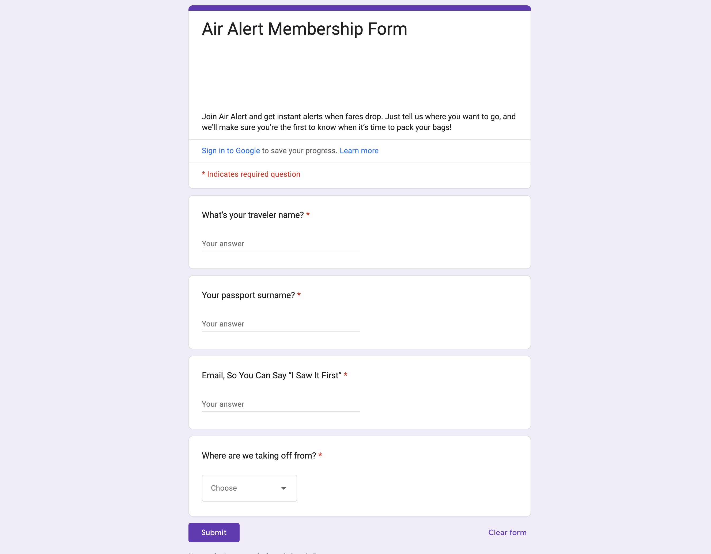

# 🛫 AirAlert -- Smarter Flight Deal Notifications

Tired of boring Google Alerts?
Meet **AirAlert** -- your personal flight deal hunter that scans
**direct AND indirect flights**, across **multiple origins**, and sends
you fun **email + WhatsApp alerts** when it finds something cheaper than
your target price. ✨

------------------------------------------------------------------------

## 🔥 Why AirAlert \> Google Alerts

-   ✅ Tracks **direct AND indirect flights** (Google Alerts can't do
    that).
-   ✅ Supports **multiple departure airports at once** -- users pick
    their **origin IATA code** from a dropdown in the form.
-   ✅ Groups users by origin → each person only gets **relevant
    deals**.
-   ✅ Sends alerts by **Email** *and* **WhatsApp** (Google won't text
    you 😉).
-   ✅ Uses live data from APIs, not static web alerts.

------------------------------------------------------------------------

## 📊 How It Works

1.  **User Signup**

    -   A **Google Form** collects traveler preferences:
        -   Origin Airport (chosen from a dropdown of valid IATA codes)
        -   Email address
    -   [📄 Google Form Link](https://docs.google.com/forms/d/e/1FAIpQLSf2K1UsAHuh7oVz_aV-DnjziWq9qBjEk2xE01y2zSlUISd0AQ/viewform?usp=dialog)

    
    

2.  **Destination Data**

    -   A connected **Google Sheet** stores the list of destinations +
        lowest acceptable prices.
    -   The script fills in missing IATA codes automatically.

3.  **Flight Search**

    -   Powered by the **Amadeus Flight API**
    -   Fetches both **direct** and **indirect** flights
    -   Picks the **cheapest option** out of both.

4.  **Notifications**

    -   Sends deal alerts to:
        -   📧 User emails (via SMTP + Gmail)
        -   💬 WhatsApp messages (via Twilio API)
\
    \
    

------------------------------------------------------------------------

## 🛠️ Tech Stack & APIs

-   **Python** (main app logic)
-   **Sheety API** -- store/manage destinations & thresholds
-   **Google Forms** -- take user input (origin + email)
-   **Amadeus Flight API** -- flight search (direct + indirect)
-   **SMTP (Gmail)** -- Email alerts
-   **Twilio API** -- WhatsApp alerts

------------------------------------------------------------------------

## ⚙️ Setup & Run

### 1. Clone the repo

``` bash
git clone https://github.com/your-username/airalert.git
cd airalert
```

### 2. Install dependencies

``` bash
pip install -r requirements.txt
```

### 3. Add your API keys & credentials

Create a `.env` file in the root folder with:

``` ini
AMADEUS_API_KEY=your_amadeus_api_key
TWILIO_SID=your_twilio_sid
TWILIO_AUTH_TOKEN=your_twilio_auth
TWILIO_PHONE=whatsapp:+1234567890
MY_EMAIL=your_email@gmail.com
MY_EMAIL_PASSWORD=your_app_password
```

### 4. Connect Google Form & Sheet

-   Link the **Google Form** to a **Google Sheet**.
-   Add your sheet's ID inside `data_manager.py`.
-   Make sure all fields are required and the **origin code dropdown**
    is enabled.

### 5. Run the program

``` bash
python main.py
```

That's it -- you'll start receiving deal alerts! 🚀

------------------------------------------------------------------------

## 📂 Project Structure

    ├── data_manager.py         # Handles Google Sheet data
    ├── flight_data.py          # Extracts cheapest flight from API results
    ├── flight_search.py        # Queries Kiwi Tequila API
    ├── notification_manager.py # Sends emails + WhatsApp alerts
    ├── main.py                 # Main program logic
    ├── requirements.txt        # Python dependencies

------------------------------------------------------------------------

## 🚀 Future Improvements

-   🌐 Fun, animated **webpage** for collecting user info (instead of
    Google Forms)
-   🤖 Natural Language → Airport Code ("San Francisco" → `SFO`)
-   🧳 Let users **add their own custom destinations**
-   📈 Pull **actual average fares per route** for better deal baselines.

------------------------------------------------------------------------

## ✨ Why You'll Love It

-   Built for **travel hackers** who want smarter alerts
-   Easy to set up and extend
-   No more spam --- **relevant, real-time, personal flight deals** 🎉

------------------------------------------------------------------------

✈️ **AirAlert** -- Because you deserve better than Google Alerts 😉
